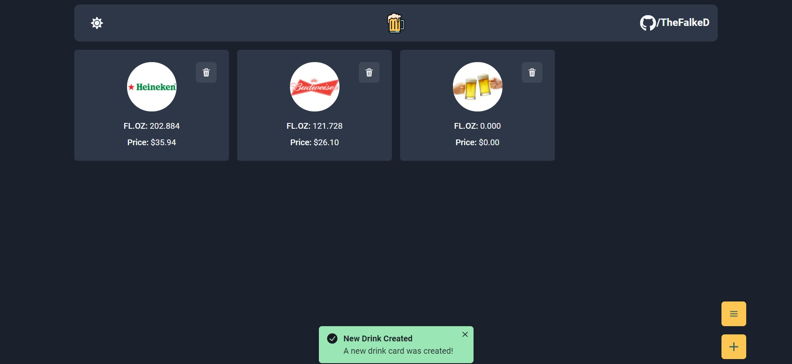

<p align="center">
  
</p>

<p align="center">
  <a href="#-technologies">Technologies</a>&nbsp;&nbsp;&nbsp;|&nbsp;&nbsp;&nbsp;
  <a href="#-project">Project</a>&nbsp;&nbsp;&nbsp;|&nbsp;&nbsp;&nbsp;
  <a href="#-layout">Layout</a>&nbsp;&nbsp;&nbsp;|&nbsp;&nbsp;&nbsp;
  <a href="#-screenshot">Screenshot</a>&nbsp;&nbsp;&nbsp;|&nbsp;&nbsp;&nbsp;
  <a href="#-how-to-run">How to run</a>&nbsp;&nbsp;&nbsp;|&nbsp;&nbsp;&nbsp;
  <a href="#-license">License</a>
</p>

<p align="center">
     
</p>

<br>

## 🧪 Technologies

This project was developed with the following technologies:

- [React](https://reactjs.org)
- [Next.js](https://nextjs.org/)
- [TypeScript](https://www.typescriptlang.org/)

## 🍺 Project

Drink Count is a simple app that allows you to track your favorite drinks and their quantity.

The project uses:

✔ React

✔ React Hooks

✔ React Context API

✔ Next.js

✔ TypeScript

✔ Cookies

✔ i18n

✔ Chakra UI

✔ Dark & Light Theme

The internacionalization gets your system language, but you can change by adding `/en` or `/pt-BR` at the end of the URL. In this project it has only two languages supported, fallbacking to the `en` (English) language.

## 🔖 Layout

Check the app deployed on Vercel in [here](https://drink-count.vercel.app).

## 🖼 Screenshot

<p align="center">
     
</p>

## 🚀 How to run

Clone the project and access its folder.

```bash
$ git clone https://github.com/thefalked/Ddrink-Count.git
$ cd Drink-Count
```

To start it, follow the steps below:

```bash
# Install dependencies
$ yarn

# Start the project
$ yarn start
```

The app will be available in your browser on the address `http://localhost:3000`.

## 📝 License

This project is under the MIT license. See the [LICENSE](LICENSE.md) file for more details.
